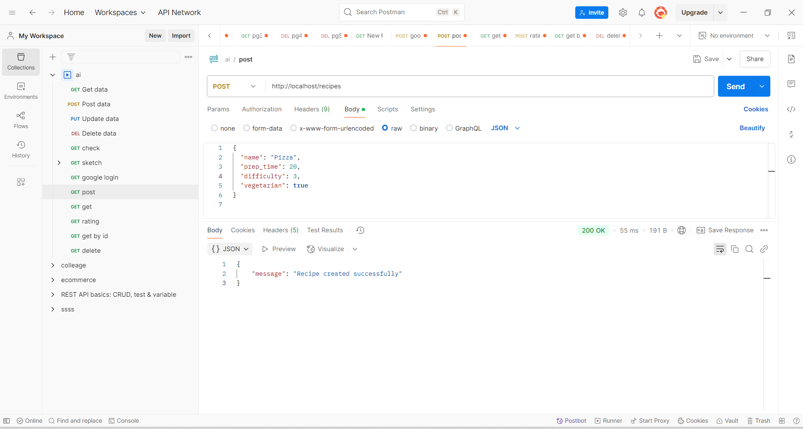
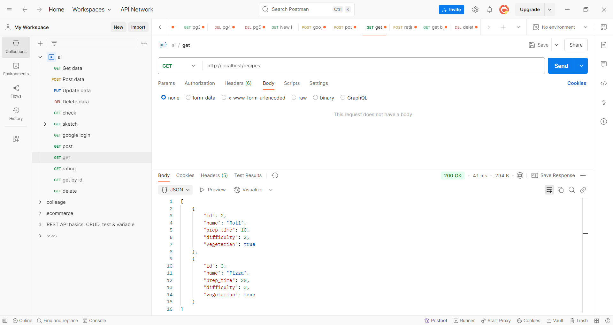
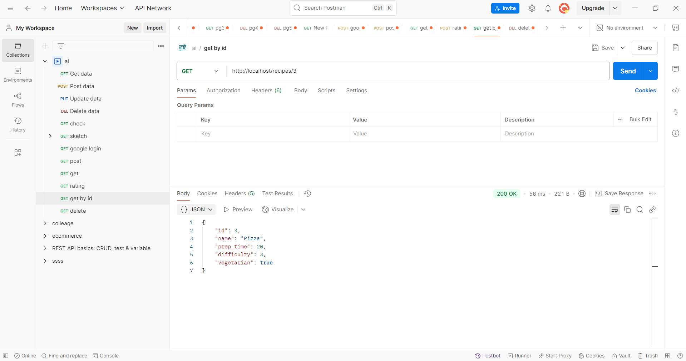
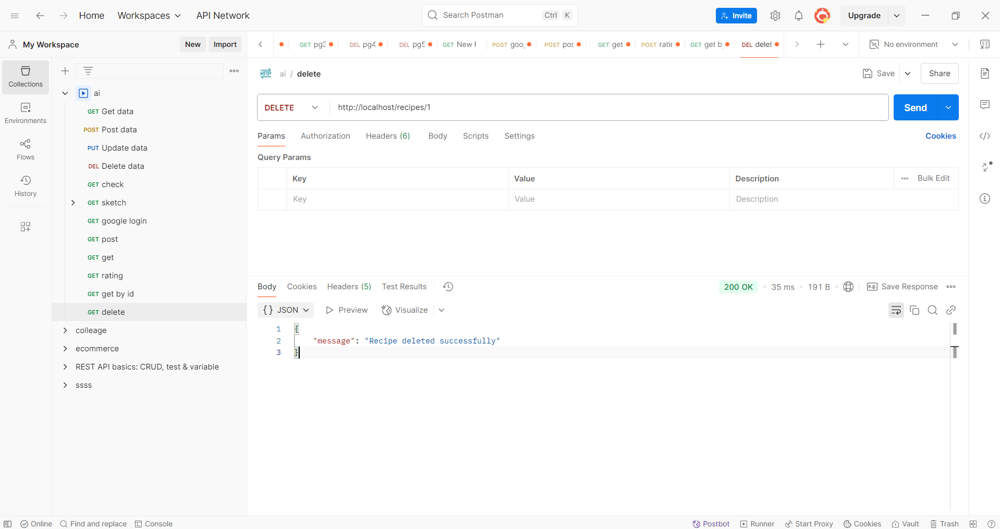
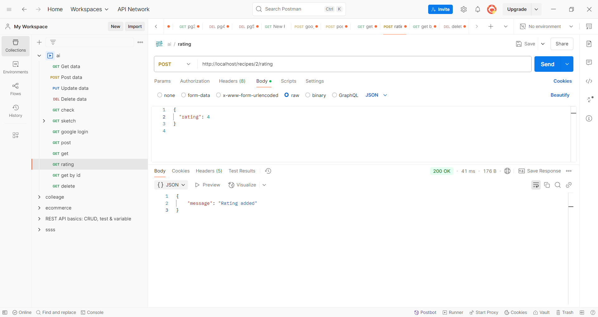

# PHP Developer Test

Hello and thanks for taking the time to try this out.

The goal of this test is to assert (to some degree) your coding and architectural skills. You're given a simple problem so you can focus on showcasing development techniques. We encourage you to overengineer the solution to show off what you can do - assume you're building a production-ready application that other developers will need to work on and add to over time.

You're **allowed and encouraged** to use third party libraries, as long as you put them together yourself **without relying on a framework or microframework** to do it for you. An effective developer knows what to build and what to reuse, but also how his/her tools work. Be prepared to answer some questions about those libraries, like why you chose them and what other alternatives you're familiar with.

As this is a code review process, please avoid adding generated code to the project. This makes our jobs as reviewers more difficult, as we can't review code you didn't write. This means avoiding libraries like _Propel ORM_, which generates thousands of lines of code in stub files.

## Prerequsites

We use [Docker](https://www.docker.com/products/docker) to administer this test. This ensures that we get an identical result to you when we test your application out, and it also matches our internal development workflows. If you don't have it already, you'll need Docker installed on your machine. **The application MUST run in the Docker containers** - if it doesn't we cannot accept your submission. You **MAY** edit the containers or add additional ones if you like (or completely re-do everything), but this **MUST** be clearly documented.

We have provided some containers to help build your application in PHP with a variety of persistence layers available to use. (you may start from scratch if you like)

### Technology

- Valid PHP 7.1 or newer
- Persist data to either Postgres, Mysql (add yourself), Redis, or MongoDB (in the provided containers).
    - Postgres connection details:
        - host: `postgres`
        - port: `5432`
        - dbname: `hellofresh`
        - username: `hellofresh`
        - password: `hellofresh`
    - Redis connection details:
        - host: `redis`
        - port: `6379`
    - MongoDB connection details:
        - host: `mongodb`
        - port: `27017`
- Use the provided `docker-compose.yml` file in the root of this repository. You are free to add more containers to this if you like.

## Instructions

1. Create a Git Repository and add these files
- Run `docker-compose up -d` to start the development environment.
- Visit `http://localhost` to see the contents of the web container and develop your application.
- Add all code changes to the git repository
- Zip all completed files (with the git repository files) and email back to us.

## Requirements

We'd like you to build a simple Recipes API. The API **MUST** conform to REST practices and **MUST** provide the following functionality:

- List, create, read, update, and delete Recipes
- Search recipes
- Rate recipes

### Endpoints

Your application **MUST** conform to the following endpoint structure and return the HTTP status codes appropriate to each operation. Endpoints specified as protected below **SHOULD** require authentication to view. The method of authentication is up to you.

##### Recipes

| Name   | Method      | URL                    | Protected |
| ---    | ---         | ---                    | ---       |
| List   | `GET`       | `/recipes`             | ✘         |
| Create | `POST`      | `/recipes`             | ✓         |
| Get    | `GET`       | `/recipes/{id}`        | ✘         |
| Update | `PUT/PATCH` | `/recipes/{id}`        | ✓         |
| Delete | `DELETE`    | `/recipes/{id}`        | ✓         |
| Rate   | `POST`      | `/recipes/{id}/rating` | ✘         |

An endpoint for recipe search functionality **MUST** also be implemented. The HTTP method and endpoint for this **MUST** be clearly documented.

### Schema

- **Recipe**
    - Unique ID
    - Name
    - Prep time
    - Difficulty (1-3)
    - Vegetarian (boolean)

Additionally, recipes can be rated many times from 1-5 and a rating is never overwritten.

If you need a more visual idea of how the data should be represented, [take a look at one of our recipe cards](https://ddw4dkk7s1lkt.cloudfront.net/card/hdp-chicken-with-farro-75b306ff.pdf?t=20160927003916).

## Evaluation criteria

These are some aspects we pay particular attention to:

- You **MUST** use packages, but you **MUST NOT** use a web-app framework or microframework. That is, you can use [symfony/dependency-injection](https://packagist.org/packages/symfony/dependency-injection) but not [symfony/symfony](https://packagist.org/packages/symfony/symfony).
- Your application **MUST** run within the containers. Please provide short setup instructions.
- The API **MUST** return valid JSON and **MUST** follow the endpoints set out above.
- You **MUST** write testable code and demonstrate unit testing it (for clarity,  PHPUnit is not considered a framework as per the first point above. We encourage you to use PHPUnit or any other kind of **testing** framework).
- You **SHOULD** pay attention to best security practices.
- You **SHOULD** follow SOLID principles where appropriate.
- You do **NOT** have to build a UI for this API.

The following earn you bonus points:

- Your answers during code review
- An informative, detailed description in the PR
- Setup with a one liner or a script
- Content negotiation
- Pagination
- Using any kind of Database Access Abstraction
- Other types of testing - e.g. integration tests
- Following the industry standard style guide for the language you choose to use - `PSR-2` etc.
- A git history (even if brief) with clear, concise commit messages. 

## SCREENSHOT
**Post Api**

**Get Api**

**get-by-id**

**delete-api.png**

**rating by id Api**

---

Good luck!
